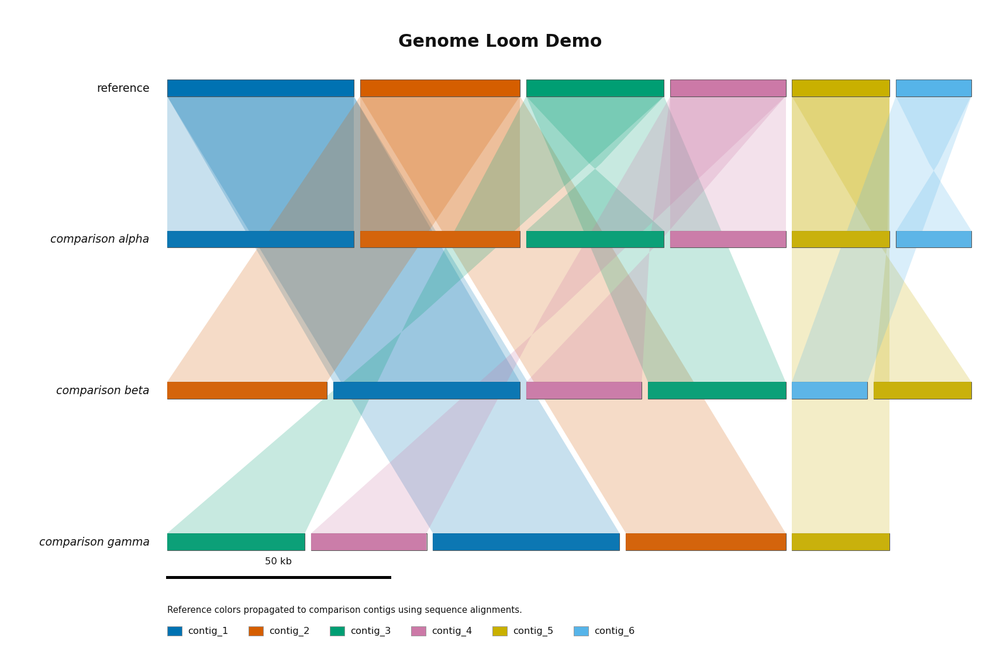
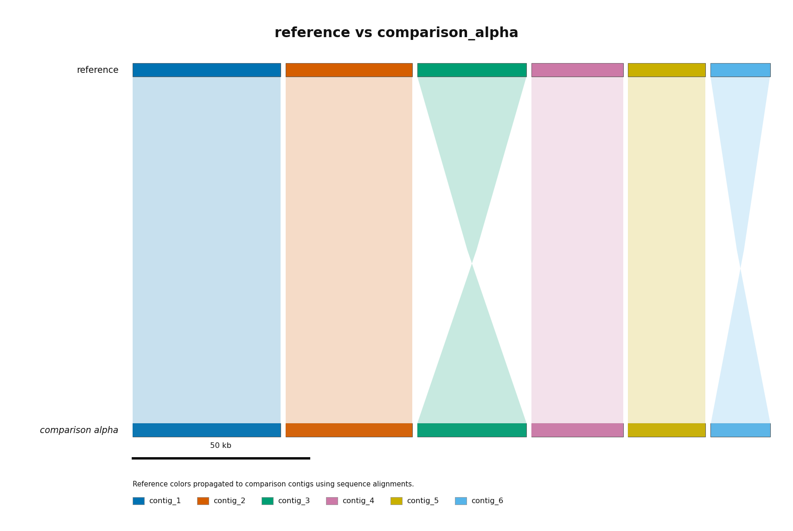
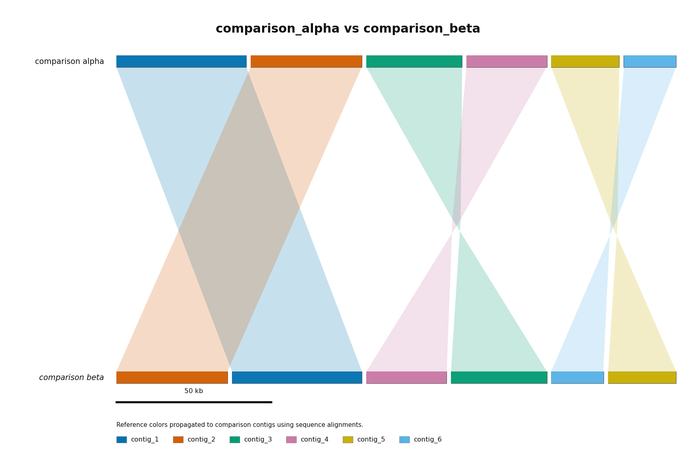
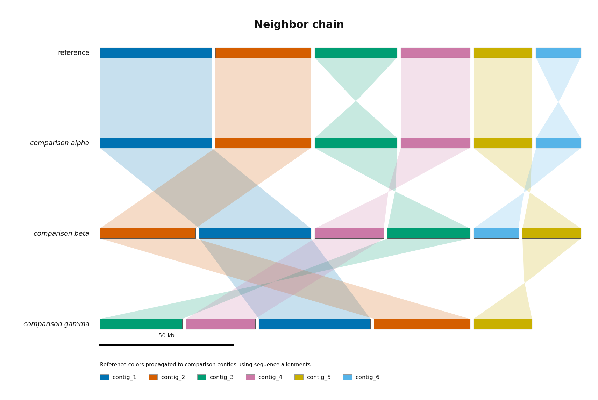

# genome-loom

Generate coordinated genome ribbon figure sets from local FASTA files. A supplied
reference genome stays at the top of the stack, comparison genomes stay in the
input order, and the figure set changes only which ribbon layer is visible.
`genome-loom` does not reorder genomes, reorder contigs, or flip contigs, so the
native coordinate system remains honest and reproducible.

| Overview | Reference Pair | All Pairs | Neighbor Chain |
| :-: | :-: | :-: | :-: |
| [](examples/output/light/overview/reference-vs-all.png) | [](examples/output/light/reference_pairs/reference-vs-comparison_alpha.png) | [](examples/output/light/all_pairs/comparison_alpha-vs-comparison_beta.png) | [](examples/output/light/neighbor/neighbor-chain.png) |

## Installation

### 1. Clone the repository

```bash
git clone https://github.com/paulstothard/genome-loom.git
cd genome-loom
```

### 2. Create the conda environment

```bash
conda env create -f environment.yml
```

This installs Python, matplotlib, Biopython, minimap2, and the other required
packages into a self-contained `genome-loom` environment.

### 3. Verify

```bash
conda run -n genome-loom minimap2 --version
conda run -n genome-loom python genome_loom.py --help
```

## Quick Start

```bash
conda activate genome-loom

python genome_loom.py \
  --reference ref.fasta \
  --comparisons genome_a.fasta genome_b.fasta genome_c.fasta \
  --outdir results \
  --views overview reference-pairs neighbor \
  --theme light
```

This writes:

```text
results/
  genome-loom.summary.json
  overview/
    reference-vs-all.png
  reference_pairs/
    reference-vs-genome_a.png
    reference-vs-genome_b.png
    reference-vs-genome_c.png
  neighbor/
    neighbor-chain.png
```

`--output one-plot.png` is still available as a compatibility shortcut for a
single overview image, but `--outdir` is the preferred workflow.

## Figure Views

- `overview`: full stack with reference-to-all ribbons.
- `reference-pairs`: one two-row figure per reference-to-comparison relationship.
- `all-pairs`: one two-row figure per selected genome pair.
- `neighbor`: one full-stack neighbor-chain figure with ribbons between adjacent rows.

The two pairwise view families are intentionally easier to read: each image
shows only the two genomes involved in that selected comparison, which creates
more vertical separation between rows and makes ribbon geometry easier to
interpret than in the full stacked views.

## Using Your Own FASTA Files

`genome_loom.py` is the main single-entry script. It is intended to behave like
a predictable, non-interactive batch command for local use or for systems such
as Proksee.

```bash
# Full figure set
python genome_loom.py \
  --reference my_reference.fasta \
  --comparisons my_genomes/ \
  --outdir results

# SVG output, dark theme, all figure families
python genome_loom.py \
  --reference ref.fasta \
  --comparisons set_a/ set_b/ outgroup.fasta \
  --outdir results \
  --views overview reference-pairs all-pairs neighbor \
  --theme dark \
  --format svg \
  --width 14 --height 9 --dpi 300 \
  --title "Genome Loom Example"

# Server-style run with explicit summary and work directory
python genome_loom.py \
  --reference ref.fasta \
  --comparisons comparisons/ \
  --outdir results \
  --summary-output results/results.json \
  --work-dir results/work \
  --threads 8 \
  --force

# JSON-config driven run
python genome_loom.py --config run.json --outdir results --force
```

Key options are summarized below; run `python genome_loom.py --help` for the
full reference.

| Option | Default | Description |
| --- | --- | --- |
| `--reference` | — | Reference genome FASTA (required) |
| `--comparisons` | — | Comparison FASTAs: files and/or directories scanned one level deep for `.fa`, `.fasta`, `.fna`, or `.fas` files |
| `--outdir` | — | Output directory for figure families and summary JSON |
| `--output` | — | Compatibility shortcut for one overview image |
| `--summary-output` | `outdir/genome-loom.summary.json` | Machine-readable JSON summary |
| `--views` | `overview reference-pairs neighbor` | Figure families to generate |
| `--format` | `png` | `png`, `pdf`, or `svg` |
| `--theme` | `light` | `light` or `dark` |
| `--width` / `--height` | `12` / `8` | Figure dimensions in inches |
| `--dpi` | `300` | Output resolution |
| `--title` | — | Figure title override |
| `--min-contig-length` | `1000` | Discard contigs shorter than this before rendering |
| `--max-contigs` | `0` | Cap visible contig blocks per genome; `0` keeps all contigs |
| `--min-block-length` | `500` | Discard short alignment blocks |
| `--minimap-preset` | `asm5` | `asm5`, `asm10`, or `asm20` |
| `--min-mapq` | `0` | Discard low-confidence alignment blocks |
| `--threads` | `1` | Thread count passed to minimap2 |
| `--tmpdir` | — | Parent directory for an auto-created temporary work directory |
| `--work-dir` | — | Explicit intermediate directory for prepared FASTAs and cached files |
| `--keep-temp` | off | Keep an auto-created temporary work directory after the run |
| `--force` | off | Allow overwriting existing outputs and reusing a non-empty `--work-dir` |
| `--config` | — | JSON config file; CLI arguments override config values |
| `--version` | — | Print version and exit |

## Server and Batch Use

`genome_loom.py` is the preferred entry point for an analysis server. It
requires explicit inputs, never prompts interactively, exits nonzero on failure,
and writes a machine-readable JSON summary for the caller.

Example server-style command:

```bash
python genome_loom.py \
  --reference /job/reference.fasta \
  --comparisons /job/comparisons \
  --outdir /job/results \
  --summary-output /job/results/results.json \
  --work-dir /job/results/work \
  --threads 8 \
  --force
```

Practical recommendations for predictable server-side operation:

- Pass absolute paths or paths inside the job directory.
- Use `--summary-output` with a known filename such as `results.json`.
- Use `--work-dir` if prepared FASTAs should be retained for debugging or caching.
- Use `--tmpdir` when temporary files should live on fast local scratch storage.
- Use `--force` when re-running into an existing results directory or work directory.

If `--work-dir` is omitted, `genome-loom` creates a temporary working directory.
That directory is deleted after the run unless `--keep-temp` is used. If
`--keep-temp` is supplied without `--work-dir`, the auto-created temporary work
directory is kept and reported in the summary JSON.

The JSON summary includes:

- `status`, `tool`, `version`, and timestamp
- input paths and output paths
- figure-generation settings
- filtering and alignment settings
- genome order and per-genome contig summaries
- one record per generated figure
- one record per computed pairwise alignment
- warnings, such as likely crowding in full-stack views

On failure, the summary still attempts to record the error type, message, and
the output paths already known to the wrapper.

### JSON Config Files

`--config` accepts a JSON object that uses option names as keys. For example:

```json
{
  "reference": "ref.fasta",
  "comparisons": ["comparison_a.fasta", "comparison_b.fasta"],
  "outdir": "results",
  "views": ["overview", "reference-pairs", "neighbor"],
  "theme": "light",
  "max_contigs": 12,
  "threads": 4
}
```

Command-line arguments override values loaded from the config file, so a caller
can keep a stable base config and customize only a few fields per job.

## Alignment Settings

`genome-loom` currently uses `minimap2` for all alignments. The main alignment
mode option is the minimap2 preset:

- `--minimap-preset asm5`: strictest and usually best for very close assemblies or strain-level work.
- `--minimap-preset asm10`: more tolerant when expected matches start to disappear.
- `--minimap-preset asm20`: loosest of the three standard assembly presets and best for more divergent exploratory comparisons.

Other alignment-related options:

- `--min-block-length`: discard short alignment blocks after minimap2 runs.
- `--min-mapq`: discard low-confidence blocks by mapping quality.
- `--threads`: controls the minimap2 thread count.

Practical rule of thumb:

- Use `asm5` for close same-species or strain comparisons.
- Try `asm10` if expected ribbons disappear for moderately diverged genomes.
- Try `asm20` when sensitivity matters more than strictness.

## Color Propagation and Figure Meaning

For `overview`, `reference-pairs`, `neighbor`, and any `all-pairs` figure that
includes the reference, ribbons use reference-flow colors. A reference contig
color follows the aligned DNA into comparison rows, and comparison contig bars
are painted where direct reference-alignment evidence indicates
reference-derived sequence is present.

That propagated comparison-contig coloring is global across the figure set, so
it remains visible even when the current image is showing only one selected pair
or a neighbor-chain ribbon layer. In `neighbor`, those colors can continue to
percolate downward through adjacent comparisons.

For `all-pairs` images that do not include the reference, ribbons are colored
locally from the upper genome in that selected pair because the ribbon itself no
longer contains a direct reference thread. The comparison contig bars are still
painted from direct reference evidence when available. The JSON render metadata
records ribbon coloring as either `reference-flow` or `subject-local`, and
comparison contig coloring as `reference-propagated` when global reference
coloring is active.

Reference colors are assigned by contig size, not FASTA order. The largest
reference contig receives the first palette color, the next largest receives the
second, and so on. Once the palette is exhausted, the remaining smaller contigs
share the fallback color. That fallback color still flows through matches, but
it no longer distinguishes which individual small contig contributed a given
fallback thread.

## Contig Capping and Fragmented Assemblies

Use `--max-contigs` to keep highly fragmented assemblies readable.

- `0` keeps all contigs.
- `N` keeps the largest `N - 1` contigs as separate visible blocks.
- The remaining smaller contigs are merged into one trailing
  `remaining_contigs_N` block.

The kept contigs preserve their original relative FASTA order. Smaller contigs
that are not kept as separate blocks are moved into the trailing merged block.
That merged block is aligned and can carry propagated reference color, but it
always uses the fallback color because individual small-contig contributions are
no longer distinguishable within that bin.

## Practical Recommendations

`genome-loom` is designed for microbial-scale genome comparisons, including
small plasmids through typical bacterial chromosomes. Larger assemblies can work,
but figure density and rendering time increase as genome size, genome count, and
contig count all rise together.

### Genome Size

- Best fit: small plasmids through typical bacterial genomes, roughly tens of kb to about 10 Mb.
- Still practical with care: larger bacterial assemblies and some small eukaryotic scaffolds up to roughly 100 Mb.
- Use caution beyond that: figures can become sparse, slow to render, and harder to interpret unless heavily filtered.

### Total Genome Count Per Figure

For full-stack views such as `overview` and `neighbor`, a good rule of thumb is:

```text
recommended total genomes <= figure height in inches / 0.6
```

So for the default `12 x 8` inch figure, aim for roughly 13 genomes or fewer in
the full stacked views. In practice:

- Best readability: about 4 to 10 total genomes.
- Usually still workable: about 11 to 13 total genomes, especially with short names and contig capping.
- Above that: increase figure height, reduce the genome set, or lean more heavily on the pairwise view families.

`genome-loom` prints a warning to `stderr` and records it in the summary JSON
when the selected full-stack views are likely to look crowded at the chosen
height.

### Contigs Per Genome

- Best readability: keep visible contig blocks in the single digits to low teens.
- For fragmented bacterial assemblies, `--max-contigs 6` to `--max-contigs 24` is often a good range.
- If many genomes are shown at once, lean toward lower `--max-contigs` values.

### Labels and Long Names

Genome row labels shrink as figures get more crowded, and contig-legend items
wrap onto additional rows. Long legend labels are truncated with an ellipsis
when needed. If row labels or contig legends start to feel dense, the best
fixes are:

- increase figure height
- reduce the genome set for full-stack views
- lower `--max-contigs`
- rely on pairwise views for detailed interpretation

## Example Data and Example Rendering

Generate deterministic synthetic genomes plus two real-data example sets:

```bash
bash make_examples.sh
```

This writes:

```text
examples/data/
examples/real_data/ecoli/
examples/real_data/most_contigs/
examples/output/light/
examples/output/dark/
examples/output/ecoli_real/
examples/output/most_contigs/
```

The real-data examples are copied from local `genome-artistry` example datasets:

- `ecoli_real`: one complete E. coli reference plus three comparisons.
- `most_contigs`: the most fragmented local FASTA found in the neighboring
  `genome-artistry` example/montage cache plus three nearby comparisons.

These example sets are useful for checking how contig capping, propagated
reference color, and ribbon readability behave on both simple and fragmented
assemblies.
